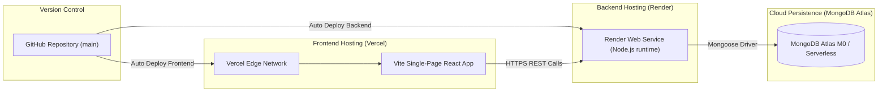

# ReviewLens — System Architecture Specification

> **Document Version:** 2.0.0  
> **Status:** Approved / Authoritative Source of Truth  
> **Lead Architect & Technical Planner:** ReviewLens Core Team  
> **Scope:** End-to-end data flow, frontend & backend architecture, exact Mongoose schemas, Gemini integration contract, deterministic Review Trust Signal, 40/20/15/15/10 recommendation pipeline, deployment topology, and security boundaries.

---

## 1. System Overview Diagram

ReviewLens enforces a strict architectural boundary: **Gemini understands review text; the application decides scores, trust, aggregation, ranking, and recommendations.** Gemini is never asked to rank, compare, or recommend venues.

### 1.1 Complete End-to-End Data Flow

```mermaid
flowchart TD
    subgraph Client["Frontend Client (React + Vite + Tailwind)"]
        UI["Mobile-First UI (Pages & Components)"]
        ApiClient["services/api.js (Centralized Client)"]
        UI -->|Invokes API methods| ApiClient
    end

    subgraph Server["Backend Application (Node.js + Express)"]
        Router["Express Routers (/api/places, /reviews, /recommendations)"]
        Controllers["Controllers (place, review, recommendation)"]
        
        subgraph DomainServices["Service Layer (Business Logic)"]
            ReviewSvc["reviewService.js"]
            AISvc["aiService.js (AI_MODE Branching)"]
            TrustSvc["trustService.js (Deterministic Heuristics)"]
            ScoringSvc["scoringService.js (40/20/15/15/10 Formula)"]
            RecSvc["recommendationService.js (Orchestrator)"]
        end
    end

    subgraph ExternalAI["AI Integration Layer"]
        GeminiAPI["Google Gemini API (gemini-1.5-flash)"]
        MockEngine["Deterministic Mock Generator"]
    end

    subgraph Database["Persistence Layer (MongoDB Atlas)"]
        ColPlaces[("Places Collection")]
        ColReviews[("Reviews Collection")]
        ColAnalysis[("ReviewAnalysis Collection")]
    end

    %% Client-Server Communication
    ApiClient -->|REST HTTP / JSON| Router
    Router --> Controllers

    %% Pipeline 1: Review Ingestion & Intelligence
    Controllers -->|Review Submission / Ingestion| ReviewSvc
    ReviewSvc -->|Review Text + Category Context| AISvc
    AISvc -->|AI_MODE=live| GeminiAPI
    AISvc -->|AI_MODE=mock| MockEngine
    ReviewSvc -->|Review Text + Metadata + Place Context| TrustSvc
    ReviewSvc -->|Persist Structured Analysis & Trust| ColAnalysis
    ReviewSvc -->|Write/Update Reviews| ColReviews
    ReviewSvc -->|Recalculate & Cache Aggregates| ColPlaces

    %% Pipeline 2: Recommendation & Scoring Query
    Controllers -->|User Preferences + Context Filters| RecSvc
    RecSvc -->|Query Candidates & Precomputed Aggregates| ColPlaces
    RecSvc -->|Candidate Aggregates + User Preferences| ScoringSvc
    ScoringSvc -->|Final Scores (0-100)| RecSvc
    RecSvc -->|Ranked Results + Traceable 'Why' Bullets| Controllers
    Controllers -->|Structured JSON Response| ApiClient
```

### 1.2 ASCII Flow Trace

```text
React / Vite Client (Mobile-First UI)
       │
       ▼  (services/api.js: Single Centralized API Client)
REST API (Express Controllers)
       │
       ├──► [REVIEW INGESTION & ANALYSIS PIPELINE]
       │       │
       │       ├──► reviewService.js
       │       │       │
       │       │       ├──► aiService.js
       │       │       │       ├──► Gemini API (AI_MODE=live)  ──► Structured Aspect JSON
       │       │       │       └──► Mock Engine (AI_MODE=mock) ──► Deterministic Heuristic JSON
       │       │       │
       │       │       └──► trustService.js (Deterministic Review Trust Signal)
       │       │               └──► Heuristic Authenticity Score (0-100), Level & Reasons
       │       ▼
       │    MongoDB Atlas (Persisted Place, Review, and ReviewAnalysis Collections)
       │
       └──► [RECOMMENDATION & SCORING PIPELINE]
               │
               ├──► recommendationService.js (Candidate filtering by destination & category)
               │       │
               │       ├──► scoringService.js
               │       │       ├── 40% User Preference / Aspect Match
               │       │       ├── 20% Context Match (Party & Budget)
               │       │       ├── 15% Verified Customer Sentiment
               │       │       ├── 15% Trust-Adjusted Quality
               │       │       └── 10% Overall Star Rating
               │       │
               │       └──► Traceable "Why Recommended" Explanation Generator
               ▼
        Ranked Place Cards + Verified Match Bullets ──► Client UI
```

---

## 2. Frontend Architecture

### 2.1 Page-Level Routing Structure

The client application routes are defined in `client/src/App.jsx` using `react-router-dom` (v6) with a persistent shared layout (`MainLayout.jsx`):

| Route Path | Page Component | Functional Purpose |
|---|---|---|
| `/` | `Home.jsx` | Landing hero, value proposition, destination quick-jump chips, featured venues, and primary personalization CTA. |
| `/explore` | `Explore.jsx` | Browse & search view. Full-text search, destination city filter, place type toggles (Hotel, Restaurant, Cafe, Attraction), and sorting controls. |
| `/preferences` | `Preferences.jsx` | Interactive personalization wizard. Collects destination, place category, travel context (`solo`, `couple`, `family`, `business`), budget (`low`, `medium`, `high`), and weighted priorities across the 8 canonical aspects. |
| `/recommendations` | `Recommendations.jsx` | Ranked venue results matching user preferences. Displays hero match score badge (`NN%`), Review Trust Signal badge, key matching highlights, and triggers the "Why Recommended" panel. |
| `/places/:id` | `PlaceDetails.jsx` | Comprehensive venue profile. Photography, address, star rating, verified review count, aggregated aspect breakdown bars, and review feed. |
| `/intelligence` | `ReviewIntelligence.jsx` | Deep credibility audit dashboard. Surfaces aggregated Review Trust Signal breakdown (higher-trust, medium, high-risk), positive vs. negative evidence quotes, and sentiment trends. |

### 2.2 Lightweight State Management Approach

ReviewLens strictly avoids heavy state stores (no Redux, no Zustand, no MobX).

1. **Local Component State (`useState`, `useReducer`):**  
   Encapsulates all component-specific UI concerns: active filter tags, search text input, tab selection, accordion toggles, loading skeletons, and bottom-sheet/side-panel visibility.
2. **Lifted State via React Context API (`PreferencesContext`):**  
   User personalization parameters (destination, category, travel context, budget, and aspect weights) must seamlessly persist across `/preferences`, `/recommendations`, and `/explore`.  
   - Handled via a single React Context (`client/src/context/PreferencesContext.jsx`) and exposed via the custom hook `usePreferences()`.
   - Synchronized directly to `localStorage` under key `reviewlens_user_preferences`.
   - Guarantees zero latency, zero external bundle weight, and persistence across browser refreshes.
3. **Server Data Fetching:**  
   Custom hooks (`usePlaces`, `useRecommendations`, `usePlaceDetails`) manage asynchronous request lifecycles, error boundaries, and loading skeletons.

### 2.3 Centralized API Client (`services/api.js`)

**Under no circumstances may a React component or hook call `fetch()` or `axios()` directly.** All network requests are routed through `client/src/services/api.js`.

#### Architectural Rationale:
- **Base URL Encapsulation:** Resolves `import.meta.env.VITE_API_URL` with fallback to `http://localhost:5000` in one single place.
- **Envelope Unwrapping:** Backend responses follow `{ data: ... }`. The API client automatically unwraps payloads, surfacing clean domain data to UI components.
- **Consistent Error Normalization:** Intercepts HTTP 4xx/5xx responses, timeouts, and network failures, returning predictable `{ error: string, data: null }` structures.
- **Mock Interchangeability:** Enables easy offline fixture substitution during isolated UI development.

#### Exported Contract:
- `getPlaces({ city, category, search })` $\rightarrow$ Queries `GET /api/places`
- `getPlaceById(id)` $\rightarrow$ Queries `GET /api/places/:id`
- `getReviews(placeId)` $\rightarrow$ Queries `GET /api/reviews?placeId=:id`
- `createReview(placeId, reviewData)` $\rightarrow$ Executes `POST /api/reviews`
- `getRecommendations(preferences)` $\rightarrow$ Executes `POST /api/recommendations` (or `GET /api/recommendations?...`)
- `getPlaceIntelligence(placeId)` $\rightarrow$ Queries `GET /api/reviews/intelligence/:placeId`

### 2.4 Mobile-First Responsive Strategy & Visual Hierarchy

#### Target Viewport Breakpoints:
- **Mobile Phones (360px – 430px):** Primary focus. Single-column layouts, generous touch targets ($\ge 44 \times 44\text{ px}$), zero horizontal scrolling, responsive image sizing.
- **Tablets (768px – 1023px):** 2-column card grid, top navigation begins appearing.
- **Desktop (1024px – 1280px+):** 3-column card grid, centered `max-w-6xl` container, top navigation header with persistent search.

#### Navigation Hierarchy:
- **Mobile (< 768px):** Fixed bottom navigation bar (`BottomNav.jsx`) with 4 icon tabs: **Home**, **Explore**, **Saved**, **Insights**. The top header (`TopNav.jsx`) collapses into a slim brand logo with contextual back buttons.
- **Desktop ($\ge$ 768px):** Bottom nav is hidden (`md:hidden`). Top nav (`TopNav.jsx`) expands to full desktop navigation with horizontal links, search input, and active route indicators.

#### "Why Recommended?" Responsive Pattern:
- **Mobile (< 768px):** Implemented as a **Touch-Friendly Bottom Sheet** (`WhyRecommendedPanel.jsx`) sliding up from the bottom with a drag handle, backdrop blur overlay, and auto-clamped height (max 80vh).
- **Desktop ($\ge$ 768px):** Automatically renders as a **Sticky Side Panel** beside the recommendation cards, enabling users to compare recommendations and evidence without losing scroll context.

#### Design System & Palette:
- **Base:** Warm neutrals (`stone-50` `#FAFAF9` page background, `stone-100` `#F5F5F4` card fills, `stone-200` borders).
- **Primary Accent:** Confident Deep Teal (`#0D9488` / `teal-600`, active states `#0F766E` / `teal-700`). Used for all primary CTAs, active nav states, and match badges.
- **Numeric Hero Data:** Scores (`NN/100` or `NN%`) are rendered with prominent typography (`font-bold text-xl` / `text-2xl font-black`) accompanied by a radial ring or horizontal meter.
- **Cards:** Rounded corners (`rounded-xl`), subtle hairline border (`border-stone-200`), soft drop shadow (`shadow-sm`).
- **Empty States:** Animated skeletons (`LoadingSkeleton.jsx`) and friendly micro-copy; zero blank white screens.

---

## 3. Backend Architecture

### 3.1 Layered Responsibility Separation

```text
[HTTP Request]
       │
       ▼
CONTROLLER LAYER (server/controllers/*)
  - HTTP protocol boundary only.
  - Extracts params, query strings, and request bodies.
  - Invokes middleware validators and delegates immediately to service layer.
  - Emits standardized JSON HTTP responses (200, 201, 400, 404, 500).
  - ZERO business logic, ZERO database queries, ZERO AI calls.
       │
       ▼
SERVICE LAYER (server/services/*)
  - Pure domain business logic, scoring formulas, and orchestration.
  - Completely decoupled from Express (unit testable without HTTP mocks).
       │
       ▼
MODEL LAYER (server/models/*)
  - Mongoose schema definitions, field types, validation constraints, and indexes.
  - Pure data shape integrity. ZERO application logic.
```

### 3.2 Service Responsibility Matrix

| Service | Owns | Does NOT own |
|---|---|---|
| `aiService.js` | Gemini API SDK integration, prompt formatting, strict JSON schema validation, response normalization, and deterministic mock generator (`AI_MODE` switch). | Candidate ranking, place scoring, Review Trust Signal calculation, or database persistence. |
| `trustService.js` | Deterministic heuristic Review Trust Signal calculation (length penalty, generic template detection, duplicate review similarity, rating-sentiment mismatch, information density). | Natural language understanding, aspect sentiment extraction, Gemini prompt calls. |
| `scoringService.js` | Exact implementation of the 40/20/15/15/10 recommendation scoring formula, aspect-weight matching, context matching, and volume confidence math. | Fetching records from MongoDB, external network calls, HTTP serialization. |
| `recommendationService.js` | End-to-end recommendation orchestration: candidate filtering by city/category, invoking `scoringService`, descending ranking, and generating traceable "Why Recommended" explanation bullets. | Low-level scoring arithmetic (delegates to `scoringService`), raw AI extraction. |
| `reviewService.js` | Review CRUD operations, querying reviews by place, orchestrating analysis caching, aggregating place-level review scores and trust averages. | Direct Gemini API calls (delegates to `aiService`), composite recommendation ranking. |

---

## 4. Data Models

All schemas are implemented via Mongoose in `server/models/`.

### 4.1 Place Schema (`server/models/Place.js`)

```javascript
const mongoose = require('mongoose');

const PlaceSchema = new mongoose.Schema(
  {
    _id: {
      type: String, // String slug matching seed (e.g. 'p101') or ObjectId
      required: true
    },
    name: {
      type: String,
      required: [true, 'Place name is required'],
      trim: true,
      index: true
    },
    category: {
      type: String,
      required: [true, 'Category is required'],
      enum: ['hotel', 'restaurant', 'cafe', 'attraction'],
      index: true
    },
    city: {
      type: String,
      required: [true, 'City is required'],
      trim: true,
      index: true
    },
    priceLevel: {
      type: String,
      required: true,
      enum: ['low', 'medium', 'high'],
      default: 'medium'
    },
    overallRating: {
      type: Number,
      required: true,
      min: 1.0,
      max: 5.0,
      default: 3.0
    },
    address: {
      type: String,
      required: true,
      trim: true
    },
    imageUrl: {
      type: String,
      required: true
    },
    reviewCount: {
      type: Number,
      default: 0
    },
    // Precomputed Aggregates (cached from ReviewAnalysis documents)
    aggregateScores: {
      aspects: {
        quality:       { avgScore: { type: Number, default: null }, mentionCount: { type: Number, default: 0 } },
        cleanliness:   { avgScore: { type: Number, default: null }, mentionCount: { type: Number, default: 0 } },
        service:       { avgScore: { type: Number, default: null }, mentionCount: { type: Number, default: 0 } },
        price:         { avgScore: { type: Number, default: null }, mentionCount: { type: Number, default: 0 } },
        crowd:         { avgScore: { type: Number, default: null }, mentionCount: { type: Number, default: 0 } },
        safety:        { avgScore: { type: Number, default: null }, mentionCount: { type: Number, default: 0 } },
        accessibility: { avgScore: { type: Number, default: null }, mentionCount: { type: Number, default: 0 } },
        facilities:    { avgScore: { type: Number, default: null }, mentionCount: { type: Number, default: 0 } }
      },
      trustScore: {
        type: Number,
        min: 0,
        max: 100,
        default: 100
      },
      sentimentAverage: {
        type: Number, // 0.0 to 1.0
        default: 0.5
      },
      sentimentSummary: {
        positiveCount: { type: Number, default: 0 },
        neutralCount:  { type: Number, default: 0 },
        negativeCount: { type: Number, default: 0 }
      }
    }
  },
  { timestamps: true }
);

PlaceSchema.index({ city: 1, category: 1 });
module.exports = mongoose.model('Place', PlaceSchema);
```

### 4.2 Review Schema (`server/models/Review.js`)

```javascript
const mongoose = require('mongoose');

const ReviewSchema = new mongoose.Schema(
  {
    _id: {
      type: String, // String identifier (e.g. 'r1') or ObjectId
      required: true
    },
    placeId: {
      type: String,
      ref: 'Place',
      required: [true, 'placeId is required'],
      index: true
    },
    authorName: {
      type: String,
      required: true,
      trim: true
    },
    rating: {
      type: Number,
      required: true,
      min: 1,
      max: 5
    },
    text: {
      type: String,
      required: [true, 'Review text is required'],
      trim: true
    },
    visitType: {
      type: String,
      enum: ['solo', 'couple', 'family', 'business', 'friends', 'other'],
      default: 'other'
    },
    analyzed: {
      type: Boolean,
      default: false,
      index: true
    },
    analysisId: {
      type: mongoose.Schema.Types.ObjectId,
      ref: 'ReviewAnalysis',
      default: null
    }
  },
  { timestamps: true }
);

ReviewSchema.index({ placeId: 1, createdAt: -1 });
module.exports = mongoose.model('Review', ReviewSchema);
```

### 4.3 ReviewAnalysis Schema (`server/models/ReviewAnalysis.js`)

```javascript
const mongoose = require('mongoose');

const ReviewAnalysisSchema = new mongoose.Schema(
  {
    reviewId: {
      type: String,
      ref: 'Review',
      required: true,
      unique: true,
      index: true
    },
    placeId: {
      type: String,
      ref: 'Place',
      required: true,
      index: true
    },
    // Output from Gemini API
    sentiment: {
      type: String,
      enum: ['positive', 'neutral', 'negative'],
      required: true
    },
    sentimentScore: {
      type: Number,
      min: 0.0,
      max: 1.0,
      required: true
    },
    // The 8 Canonical Aspects (null if not mentioned)
    aspectScores: {
      quality:       { type: Number, min: 0, max: 100, default: null },
      cleanliness:   { type: Number, min: 0, max: 100, default: null },
      service:       { type: Number, min: 0, max: 100, default: null },
      price:         { type: Number, min: 0, max: 100, default: null },
      crowd:         { type: Number, min: 0, max: 100, default: null },
      safety:        { type: Number, min: 0, max: 100, default: null },
      accessibility: { type: Number, min: 0, max: 100, default: null },
      facilities:    { type: Number, min: 0, max: 100, default: null }
    },
    mentionedAspects: [{ type: String }],
    positiveEvidence: [{ type: String }],
    negativeEvidence: [{ type: String }],
    summary: {
      type: String,
      maxlength: 300,
      trim: true
    },
    confidence: {
      type: Number,
      min: 0.0,
      max: 1.0,
      required: true
    },
    // Output from deterministic trustService.js
    trustSignal: {
      trustScore: { type: Number, min: 0, max: 100, required: true },
      level: { type: String, enum: ['higher-trust', 'medium', 'high-risk'], required: true },
      reasons: [{ type: String }]
    },
    aiModel: {
      type: String,
      default: 'mock'
    },
    processedAt: {
      type: Date,
      default: Date.now
    }
  },
  { timestamps: true }
);

ReviewAnalysisSchema.index({ placeId: 1, 'trustSignal.trustScore': -1 });
module.exports = mongoose.model('ReviewAnalysis', ReviewAnalysisSchema);
```

---

## 5. AI Integration Boundary

ReviewLens enforces a strict isolation boundary between Generative AI and core business services.

### 5.1 Strict AI Responsibility Contract

1. **Permitted Input:** Gemini receives **only** raw review text + venue category context (e.g. `"hotel"`).
2. **Permitted Output:** Gemini produces **only** a strictly schema-constrained JSON object.
3. **Strict AI Prohibitions:**
   - Gemini is **never** asked to rank places.
   - Gemini is **never** asked to compare places.
   - Gemini is **never** asked to decide recommendations.
   - Gemini is **never** supplied with user profiles, locations, or browsing histories.

### 5.2 Exact Gemini Output JSON Schema

`aiService.js` instructs Gemini using structured/schema-constrained JSON mode. The schema guarantees the following exact shape:

```json
{
  "sentiment": "positive",
  "sentimentScore": 0.88,
  "aspectScores": {
    "quality": 90,
    "cleanliness": 95,
    "service": 85,
    "price": null,
    "crowd": 70,
    "safety": null,
    "accessibility": null,
    "facilities": 80
  },
  "mentionedAspects": ["quality", "cleanliness", "service", "crowd", "facilities"],
  "positiveEvidence": [
    "Spotless bathroom and crisp fresh linens",
    "Fast Wi-Fi and quiet courtyard seating"
  ],
  "negativeEvidence": [
    "Slight delay during 11am checkout peak"
  ],
  "summary": "Spotless room with excellent amenities and peaceful courtyard atmosphere.",
  "confidence": 0.92
}
```

*Inviolable Rule:* Any aspect not explicitly discussed in the review text **must be `null`**, never fabricated or guessed.

### 5.3 `AI_MODE=mock` vs `AI_MODE=live` Switch

All AI execution branching logic lives exclusively in `server/services/aiService.js`:

```javascript
// server/services/aiService.js
const analyzeReview = async (text, category) => {
  const mode = process.env.AI_MODE || 'mock';

  if (mode === 'live' && process.env.GEMINI_API_KEY) {
    return await callGeminiStructuredApi(text, category);
  }

  return runDeterministicMockAnalyzer(text, category);
};
```

- **`AI_MODE=live`:** Calls Google Gemini (`gemini-1.5-flash`) via the official SDK using schema-constrained JSON output mode. Validates and normalizes aspect scores to $[0, 100]$.
- **`AI_MODE=mock`:** Executes a deterministic keyword and sentiment heuristic analyzer. Instantly outputs valid schema-compliant objects with zero network delay, zero token consumption, and 100% test reproducibility.
- **Zero Leakage:** Calling services (`reviewService.js`) simply call `aiService.analyzeReview(text, category)` without knowing or caring whether the analysis was produced by live Gemini or mock heuristics.

---

## 6. Review Trust Signal & Recommendation Pipeline

### 6.1 Review Trust Signal (`trustService.js`)

The Review Trust Signal is a **deterministic heuristic indicator** evaluated inside `server/services/trustService.js`.

- **Official Name:** "Review Trust Signal" (NEVER "Fake Review Detector").
- **Advisory Principle:** Heuristic confidence indicator, never a definitive legal or fraud verdict.
- **Policy:** Never automatically delete or hide reviews based on trust score.

#### Heuristic Inputs & Penalties:
1. **Length Penalty:** Reviews $< 25$ characters (e.g. *"Great place!"*) lose up to $25$ trust points.
2. **Generic/Template Language:** Matching repetitive phrases (*"nice experience", "must visit with family", "good staff"*) without specific nouns incurs a $20$ point penalty.
3. **Duplicate Similarity:** High text overlap (Jaccard similarity $> 0.65$) against other reviews for the same venue incurs a $30$ point penalty.
4. **Sentiment-Rating Mismatch:** Severe divergence (e.g. 5-star rating with negative sentiment, or 1-star rating with positive sentiment) incurs a $35$ point penalty.
5. **Information Density Bonus:** Presence of specific concrete nouns (dish names, specific amenities, room types) earns up to a $+15$ point authenticity bonus (capped at 100).
6. **Burst Posting Pattern:** Multiple reviews posted from identical author patterns within a narrow window incurs a $25$ point penalty.

#### Output Shape:
```json
{
  "trustScore": 88,
  "level": "higher-trust",
  "reasons": [
    "Detailed review with specific amenity mentions",
    "Sentiment aligns with star rating",
    "No generic template phrases detected"
  ]
}
```

Levels:
- `higher-trust`: Score $\ge 80$
- `medium`: Score $50 - 79$
- `high-risk`: Score $< 50$

---

### 6.2 The 40/20/15/15/10 Recommendation Formula (`scoringService.js`)

Recommendations are computed deterministically using the exact weighted formula:

$$\text{Final Score} = (0.40 \times \text{AspectMatch}) + (0.20 \times \text{ContextMatch}) + (0.15 \times \text{Sentiment}) + (0.15 \times \text{TrustQuality}) + (0.10 \times \text{OverallRating})$$

All terms normalize to $[0, 100]$:

| Weight | Term | Owner Service | Mathematical Calculation |
|:---:|---|---|---|
| **40%** | **Preference / Aspect Match** | `scoringService.js` | User assigns priority weights $w_a \in [1, 5]$ to prioritized aspects. Let $\bar{w}_a = \frac{w_a}{\sum w_k}$. Match $= \sum \bar{w}_a \times \text{PlaceAspectScore}_a$. |
| **20%** | **Context Match** | `scoringService.js` | Evaluates travel party fit (solo, couple, family, business) against place category/vibe ($0-50\text{ pts}$) + Budget compatibility ($0-50\text{ pts}$: exact match $= 50$, 1 step $= 35$, 2 steps $= 15$). Total $= 0-100$. |
| **15%** | **Verified Sentiment** | `scoringService.js` | Aggregated verified customer sentiment: $\text{sentimentAverage} \times 100$. |
| **15%** | **Trust-Adjusted Quality** | `scoringService.js` | Quality aspect score modulated by venue trust: $\text{PlaceAspectScore}_{\text{quality}} \times \left(\frac{\text{PlaceTrustScore}}{100}\right)$. |
| **10%** | **Overall Rating** | `scoringService.js` | Scaled baseline star rating: $(\text{overallRating} - 1.0) \times 25$. |

---

### 6.3 Traceable "Why Recommended?" Rules (`recommendationService.js`)

`recommendationService.js` constructs 2 to 3 bullet points for the "Why Recommended" panel. **Every bullet must be traceable to a real calculated number**:

1. **Top Aspect Alignment Bullet:**
   - *Rule:* Only allowed if user gave aspect $a$ a high weight ($w_a \ge 4$) AND venue's score for $a$ is $\ge 80/100$.
   - *Example:* *"Cleanliness rated 94/100 across 28 reviews, matching your top preference."*
2. **Context Compatibility Bullet:**
   - *Rule:* Only allowed if Context Match score is $\ge 80/100$.
   - *Example:* *"High suitability for solo travel with dedicated workspaces and quiet environment."*
3. **Trust & Authenticity Bullet:**
   - *Rule:* Displays venue's Review Trust Signal.
   - *Example:* *"92% Review Trust Signal: Backed by substantive, detailed customer reviews."*
4. **Verbatim Evidence Bullet:**
   - *Rule:* Only quotes directly extracted in `positiveEvidence` from high-trust reviews ($\text{trustScore} \ge 80$).
   - *Example:* *"Guests highlight: 'Fast Wi-Fi and quiet courtyard seating.'"*

---

## 7. Deployment Architecture



### 7.1 Platform Roles
- **Frontend (Vercel):** Hosts the static React SPA built via `vite build`. Configured with `vercel.json` rewrite rule to redirect all routes to `/index.html` for client-side routing.
- **Backend (Render):** Hosts the Express API as a Node.js Web Service running `node server.js` from the `server/` root.
- **Database (MongoDB Atlas):** Multi-region cloud MongoDB database with IP whitelist `0.0.0.0/0` and secure credential access.

### 7.2 Environment Variable Matrix

| Variable | Local Development | Render (Production Server) | Vercel (Production Client) | Purpose |
|---|---|---|---|---|
| `PORT` | `5000` | Injected by Render | *N/A* | Express HTTP port |
| `NODE_ENV` | `development` | `production` | `production` | Runtime mode |
| `CLIENT_URL` | `http://localhost:5173` | `https://reviewlens.vercel.app` | *N/A* | CORS allowed origin |
| `MONGODB_URI` | `mongodb://localhost:27017/reviewlens` | Production Atlas Connection String | **STRICTLY FORBIDDEN** | Database credentials |
| `GEMINI_API_KEY` | Developer Key or blank if mock | Google AI Studio Production Key | **STRICTLY FORBIDDEN** | Gemini API authentication |
| `GEMINI_MODEL` | `gemini-1.5-flash` | `gemini-1.5-flash` | *N/A* | Gemini model identifier |
| `AI_MODE` | `mock` (or `live`) | `live` | *N/A* | Switches AI mode |
| `VITE_API_URL` | `http://localhost:5000` | *N/A* | `https://reviewlens-api.onrender.com` | Base backend URL |

---

## 8. Security Boundaries

### 8.1 Forbidden Secrets in Frontend Code
Under no circumstances may any of the following appear in client code, client bundles, or network payloads:
1. **`GEMINI_API_KEY`:** Kept strictly inside server environment variables. Never prefixed with `VITE_`.
2. **`MONGODB_URI`:** Kept strictly on the backend.
3. **Raw Gemini Prompts:** Prompt engineering templates, few-shot examples, and system instructions reside solely in `server/services/aiService.js`. The client only sends structured requests.
4. **Internal Scoring Weights & Raw Multipliers:** Client receives only clean scores, badges, and human-readable reasons.

### 8.2 Server-Side Hardening
- **Strict CORS Policy:** Restricted to `CLIENT_URL` in production; wildcard origins allowed only in development.
- **Payload Validation & Clamping:** All review text is validated via `middleware/validateRequest.js`, clamped to a maximum length (2,000 characters), and sanitized against control characters to prevent prompt injection and DoS attacks.
- **Error Obfuscation:** Centralized error handler (`middleware/errorHandler.js`) strips internal database traces and call stacks in production mode.
