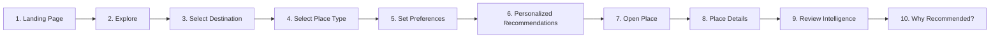

# ReviewLens — Project Specification

> **Document Version:** 1.0.0  
> **Status:** Approved / Authoritative Specification  
> **Lead Architect & Technical Planner:** ReviewLens Core Team  
> **Scope:** Product Definition, User Flows, Canonical Taxonomy, Functional & Non-Functional Requirements, and Boundary Constraints.

---

## 1. Project Mission & Definition

ReviewLens is a **mobile-first, AI-powered review intelligence and personalized recommendation platform** built specifically for four core hospitality and leisure categories:
1. **Hotels**
2. **Restaurants**
3. **Cafes**
4. **Tourist Places & Attractions**

### The Core Problem
Conventional platforms (e.g. Google Maps, TripAdvisor, Yelp) present users with flattened, unhelpful star ratings (e.g., 4.2 out of 5 stars based on 1,400 reviews). These averages suffer from:
- **Ratings Inflation:** Nearly every venue sits between 3.8 and 4.4 stars.
- **Context Blindness:** A venue rated 4.5 by loud weekend party crowds may be completely unsuitable for a remote worker needing reliable Wi-Fi and quiet atmosphere.
- **Review Pollution:** Generic, one-line ratings ("Great food!") and suspected bot/incentivized reviews mask genuine user experiences.
- **Analysis Paralysis:** Users waste 20+ minutes reading dozens of reviews to answer a basic question.

### The ReviewLens Solution
ReviewLens shifts from *"What is this place's generic average?"* to answering:
> **"Which place is actually suitable for ME, and WHY?"**

ReviewLens extracts deep structured intelligence from unstructured customer reviews, checks reviews with a deterministic **Review Trust Signal**, scores venues against the user's personal aspect priorities via a transparent mathematical formula, and surfaces crystal-clear, mathematically verified **"Why Recommended"** explanations.

---

## 2. Non-Negotiable Core Principle

> **Gemini understands review text. The application backend decides scores, trust, aggregation, ranking, and recommendations.**

- **Gemini's Role:** Dedicated Natural Language Understanding (NLU). Gemini reads an individual review's text alongside the venue category and maps it strictly into a schema-constrained JSON object (sentiment, aspect scores, evidence quotes, and summary).
- **The Application's Role:** Node.js/Express backend services handle all mathematical calculations, trust signal heuristics, aggregation across reviews, preference weighting, candidate ranking, and recommendation generation.
- **Strict Prohibition:** Gemini is **NEVER** asked *"Which place is best?"*, *"Rank these three hotels"*, or *"Recommend a restaurant for this user"*. All recommendations are generated deterministically by the application engine.

---

## 3. End-to-End User Flow

The user journey is structured as a guided, low-friction funnel designed for mobile-first interaction:



### Step-by-Step Experience:
1. **Landing Page (`/`):** Hero headline, value proposition ("Find what fits you, verified by authentic review intelligence"), quick destination jump chips, top-rated spotlight, and primary CTA: *"Find My Perfect Place"*.
2. **Explore (`/explore`):** Interactive browse view. Full-text search bar and filter controls.
3. **Select Destination:** User picks a target city from the catalog (e.g., *Indore*, *Bhopal*, *Jaipur*, *Mumbai*).
4. **Select Place Type:** Category selector toggle (Hotels, Restaurants, Cafes, Attractions).
5. **Set Preferences (`/preferences`):** Interactive priority wizard. Users configure:
   - Budget / Price tier (`low`, `medium`, `high`).
   - Context / Travel Party (`solo`, `couple`, `family`, `business`, `friends`).
   - Aspect Priority Weights: Sliders or priority badges for the 8 canonical aspects (e.g., Cleanliness: High, Crowd: Low/Quiet preferred, Quality: High).
6. **Personalized Recommendations (`/recommendations`):** Real-time ranked list of matching venues. Each venue card displays:
   - Composite Match Score badge (`NN% Match`).
   - Review Trust Signal indicator (`Higher-Trust`, `Medium`, or `High-Risk`).
   - Key matching aspect badges.
   - Quick trigger button: *"Why Recommended?"*.
7. **Open Place:** Tapping a card opens the place profile.
8. **Place Details (`/places/:id`):** Venue photography, address, price level, star rating, verified review count, and aggregated aspect score overview.
9. **Review Intelligence (`/intelligence` or embedded tab):** Deep-dive credibility audit. Displays:
   - Aggregate Review Trust Signal distribution (breakdown of higher-trust vs high-risk reviews).
   - Extracted positive evidence quotes vs negative evidence quotes.
   - Sentiment breakdown over time.
10. **Why Recommended? (Bottom Sheet on Mobile, Side Panel on Desktop):** Traceable explanation breakdown showing the exact mathematical drivers behind the match.

---

## 4. Supported Aspects (The 8 Canonical Aspects)

The system operates across **exactly 8 canonical aspects** throughout the database, AI schemas, preference sliders, and recommendation math:

| Aspect Key | Display Name | Applicable Categories | Typical Indicators & Review Mentions |
|---|---|---|---|
| `quality` | Quality | All (Hotels, Restaurants, Cafes, Attractions) | Food taste, drink craftsmanship, bed/room comfort, exhibit quality, overall venue caliber. |
| `cleanliness` | Cleanliness | All | Spotless bathrooms, clean linens, table sanitation, odorless rooms, hygienic dining environment. |
| `service` | Service | All | Staff courtesy, check-in speed, waiter responsiveness, attentiveness, issue resolution. |
| `price` | Price & Value | All | Value for money, fair portions, reasonable ticket pricing, transparent billing, affordable rates. |
| `crowd` | Crowd Level | All | Noise levels, wait times, packed seating, peak-hour rush, serene/peaceful atmosphere vs chaotic bustle. |
| `safety` | Safety | All | Secure neighborhood, nighttime lighting, well-guarded entry, luggage security, child safety, hygiene precautions. |
| `accessibility`| Accessibility | All | Wheelchair ramps, elevator availability, step-free access, convenient parking, ease of arrival. |
| `facilities` | Facilities | All | Wi-Fi reliability, pool, power outlets, parking lot, air conditioning, seating ergonomics, restrooms. |

*Rule:* If an individual review does not comment on a given aspect, the AI analysis model must report `null` for that aspect score. Under no circumstances may scores be fabricated.

---

## 5. Review Trust Signal

The Review Trust Signal is implemented in `server/services/trustService.js` as a **purely deterministic heuristic algorithm**.

### Core Tenet
- **Naming Rule:** It is officially titled **"Review Trust Signal"**. It is **never** referred to as a "Fake Review Detector."
- **Advisory Only:** It provides an authenticity confidence indicator to help users weigh information, not an absolute legal or factual declaration.
- **No Automatic Deletion:** The system **never** automatically deletes, mutes, or hides a review because of a low trust score. High-risk reviews are simply flagged with advisory markers and their influence on the recommendation score is dampened.

### Evaluated Heuristic Signals:
1. **Review Length & Substance:** Penalizes extreme brevity (e.g., $< 25$ characters like *"Great place!"* or *"Worst hotel ever"*).
2. **Repeated Phrases & Template Patterns:** Detects boilerplate PR statements or repetitive stock phrasing across reviews.
3. **Duplicate Similarity:** Computes Jaccard/Levenshtein similarity against other reviews for the same venue to flag copy-paste campaigns.
4. **Sentiment vs Star-Rating Mismatch:** Flags reviews where the star rating conflicts sharply with textual sentiment (e.g., 5-star rating with text complaining about bad service).
5. **Information Density:** Rewards specific noun phrases, room numbers, dish names, and detailed observations; penalizes vague emotional fluff.
6. **Abnormal Posting Patterns:** Detects burst patterns where multiple 5-star or 1-star reviews are posted within minutes of each other.

### Output Shape:
```typescript
interface ReviewTrustSignal {
  trustScore: number; // 0 - 100
  level: "higher-trust" | "medium" | "high-risk";
  reasons: string[]; // e.g. ["Substantive detail on specific amenities", "No generic filler phrases detected"]
}
```

---

## 6. Recommendation Formula & "Why Recommended" Rules

### The 40/20/15/15/10 Recommendation Formula
Implemented strictly in `server/services/scoringService.js`:

$$\text{Final Score} = 0.40 \times \text{AspectMatch} + 0.20 \times \text{ContextMatch} + 0.15 \times \text{Sentiment} + 0.15 \times \text{TrustQuality} + 0.10 \times \text{OverallRating}$$

1. **40% Preference / Aspect Match:** Mathematical dot product between user's prioritized aspect weights and the venue's aggregated AI aspect scores ($0-100$).
2. **20% Context Match:** Compatibility with user's travel party (`solo`, `couple`, `family`, `business`) and budget level (`low`, `medium`, `high`).
3. **15% Sentiment:** Normalized sentiment score ($0-100$) derived from verified customer reviews.
4. **15% Trust-adjusted Quality:** Aggregated venue quality score modulated by the venue's overall Review Trust Signal.
5. **10% Overall Rating:** Baseline customer rating scaled from 1.0–5.0 to 0–100 ($(\text{rating} - 1.0) \times 25$).

### "Why Recommended?" Traceability Rules
- **No Fabricated Reasons:** Every bullet point surfaced to the user must link back to a real calculated score or verified database evidence.
- *Example Condition:* The bullet *"Outstanding match for Cleanliness (94/100)"* is **only** generated if:
  1. The user designated `cleanliness` as a high priority in their preferences ($w \ge 4$).
  2. The venue's aggregated `cleanliness` score is $\ge 80$.
- *Example Condition:* The bullet *"Praised for quiet workspace and reliable Wi-Fi"* is **only** permitted if verified positive quotes mentioning `facilities` or `crowd` exist in `ReviewAnalysis`.

---

## 7. Design Brief & Visual Guidelines

ReviewLens is a modern, high-trust consumer utility. It intentionally rejects the bland "default Tailwind gray/blue" aesthetic.

### 7.1 Color Palette
- **Warm Neutral Backgrounds:** Off-white / warm stone bases (`stone-50` `#FAFAF9`, `stone-100` `#F5F5F4`, `stone-200` `#E7E5E4`). Provides comfort, sophistication, and readability.
- **Primary Confident Accent:** **Deep Teal** (`#0D9488` / `teal-600`, active states `#0F766E` / `teal-700`). Used consistently across:
  - Call-to-action buttons.
  - Active bottom navigation tabs.
  - Recommendation match percentage rings and badges.
- **Trust Level Accents:**
  - *Higher-Trust:* Emerald (`emerald-600` `#059669`).
  - *Medium Trust:* Amber (`amber-500` `#D97706`).
  - *High-Risk:* Rose (`rose-500` `#F43F5E`).

### 7.2 Typography & Data Hierarchy
- Clean, highly legible sans-serif (`Inter`, system-ui).
- **Hero Data Points:** Numeric scores (e.g. `92%`, `88/100`) are rendered in large, semi-bold/bold weights (`text-xl font-bold` or `text-2xl font-black`) accompanied by a visual metric (progress bar, badge, or radial indicator). Numbers are never rendered as bare, unformatted text.

### 7.3 Cards & Touch Targets
- **Cards:** Rounded corners (`rounded-xl` or `rounded-2xl`), subtle hairline border (`border-stone-200`), soft drop shadow (`shadow-sm`).
- **Touch Targets:** Minimum $44 \times 44\text{ px}$ clickable area for all buttons, chips, and navigation icons on mobile devices.
- **Zero Blank Screens:** All loading states use animated skeleton components (`LoadingSkeleton.jsx`). Empty search queries render helpful micro-copy suggestions.

---

## 8. Mobile-First Responsive Requirements

| Device Viewport | Breakpoint Range | Layout & Navigation Pattern | "Why Recommended" Presentation |
|---|---|---|---|
| **Mobile Phone** | $360\text{px} - 430\text{px}$ | Single column, edge-to-edge padded cards, fixed 5-tab **Bottom Navigation Bar** (`BottomNav.jsx`). Slim top branding header. | Interactive **Bottom Sheet Modal** sliding up from bottom with drag handle. |
| **Tablet** | $768\text{px} - 1023\text{px}$ | 2-column card grid, top navigation bar appears, bottom nav hidden. | Centered modal or slide-over drawer. |
| **Desktop** | $1024\text{px} - 1280\text{px}+$ | 3-column card grid, centered `max-w-6xl` container, fixed **Top Navigation Bar** (`TopNav.jsx`). | Persistent **Sticky Side Panel** beside venue details. |

---

## 9. Data Scope & Seed Requirements

- **Places:** 20 to 30 seeded places across 4 diverse Indian cities (*Indore*, *Bhopal*, *Jaipur*, *Mumbai*) spanning all 4 categories (Hotels, Restaurants, Cafes, Attractions).
- **Reviews:** 100 to 200 reviews with intentional, realistic variance:
  - Uneven distribution (popular spots have 15-25 reviews; newer spots have 3-5 reviews).
  - Varied lengths: Some ultra-short (10-20 chars to trigger brevity trust penalties), some medium (50-100 words), some long and analytical (150+ words with specific room/dish names).
  - Varied sentiment: Enthusiastic positive, mixed, and strongly negative reviews.
  - Varied aspect density: Some reviews discuss only 1 aspect; others discuss 5+ aspects.

---

## 10. Scope Boundaries: MVP vs. Future Roadmap

### In-Scope for Current MVP:
- Full responsive React client with 6 core pages.
- Express REST API with controllers, routes, and error handling.
- Deterministic 40/20/15/15/10 scoring engine.
- Heuristic Review Trust Signal engine.
- Gemini 1.5 Flash structured JSON analysis client with schema enforcement.
- Deterministic offline mock fallback (`AI_MODE=mock`).
- 20-30 seeded places and 100-200 seed reviews loaded into MongoDB Atlas.
- Traceable "Why Recommended" bottom sheet / side panel.

### Explicitly OUT OF SCOPE (Do NOT build yet):
- Google Places / Google Maps live scraping or synchronization.
- Social media integrations (Reddit, Flickr, Instagram).
- Automated background cron jobs.
- User authentication, JWT sessions, or account registration (preferences are stored locally).
- Multilingual translation models.
- Computer vision / photo quality analysis.
- Native mobile applications (React Native / iOS / Android).
- Complex multi-role admin dashboard.
